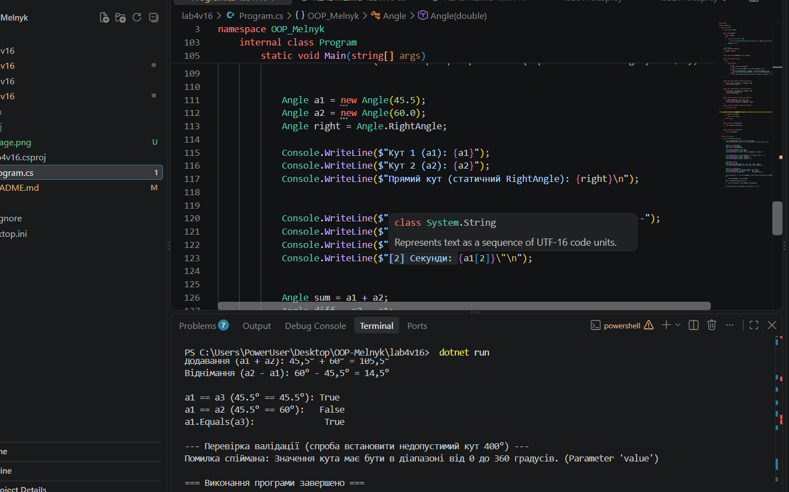

# Лабораторна робота №4

**Тема:** Властивості та статичні члени. Індексатори й перевантаження операторів  
**Студентка:** Мельник Ангеліна, група КН-3/1  
**Варіант:** 16 (Клас `Angle`)

## Результат виконання програми

# Лабораторна робота №4

**Тема:** Властивості та статичні члени. Індексатори й перевантаження операторів  
**Студентка:** Мельник Ангеліна, група КН-3/1  
**Варіант:** 16 (Клас `Angle`)

## Мета роботи
Навчитися реалізовувати властивості з перевіркою, використовувати статичні члени класу, а також застосовувати індексатори та перевантажувати оператори для створення більш виразних та зручних класів.

## Хід роботи
1. Створено новий консольний проєкт `lab4v16` за допомогою .NET SDK.
2. Реалізовано клас `Angle` (Варіант 16) з приватними полями, валідацією у властивості `Degrees` (від 0 до 360 градусов), статичним членом `RightAngle`, індексатором, перевантаженими операторами `+`, `-`, `==`, `!=` та перевизначеними методами `ToString()`, `Equals()`, `GetHashCode()`.
3. У методі `Main` продемонстровано роботу всіх створених елементів та перевірено обробку виняткових ситуацій при некоректних даних.

## Результат виконання програми
