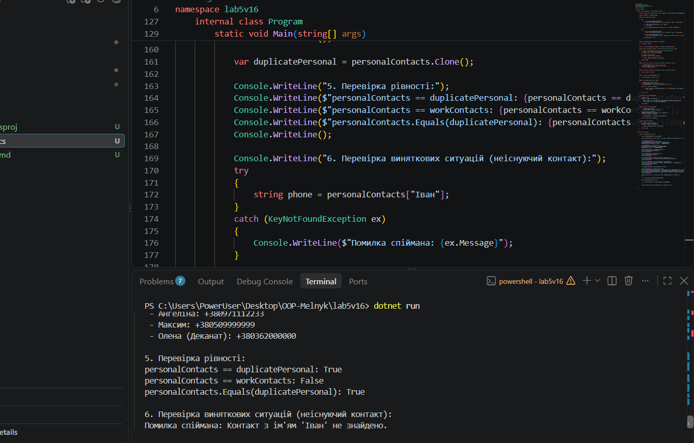

# Лабораторна робота №5

**Тема:** Індексатори та перевантаження операторів  
**Студентка:** Мельник Ангеліна, група КН-3/1  
**Варіант:** 16 (Клас `ContactList`)

## Мета роботи
Навчитися створювати індексатори для доступу до елементів класу за ключем або індексом та розширити функціональність класів через перевантаження операторів для створення більш виразного і зручного коду.

## Хід роботи
1. Створено новий консольний проєкт `lab5v16` за допомогою .NET SDK.
2. Реалізовано клас `ContactList` (Варіант 16) з приватним словарним полем `_contacts`, індексатором `this[string name]`, перевантаженим оператором `+` для об'єднання списків, операторами порівняння `==` та `!=`, а також перевизначеними методами `ToString()`, `Equals()` та `GetHashCode()`.
3. У методі `Main` продемонстровано читання та запис елементів через індексатор, додавання контактів, об'єднання двох списків контактов та обробку виняткових ситуацій при використанні неіснуючих ключів.

## Результат виконання програми

